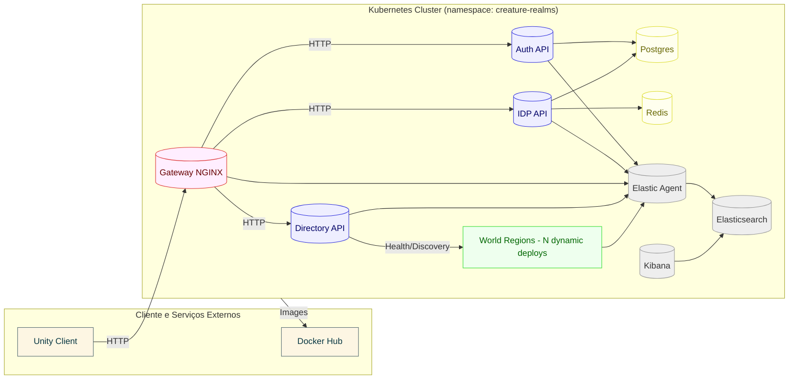
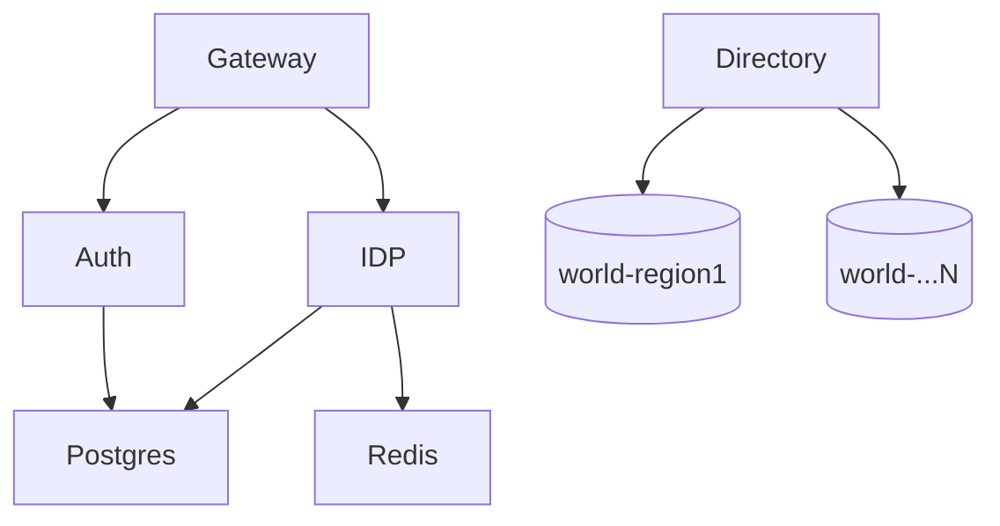
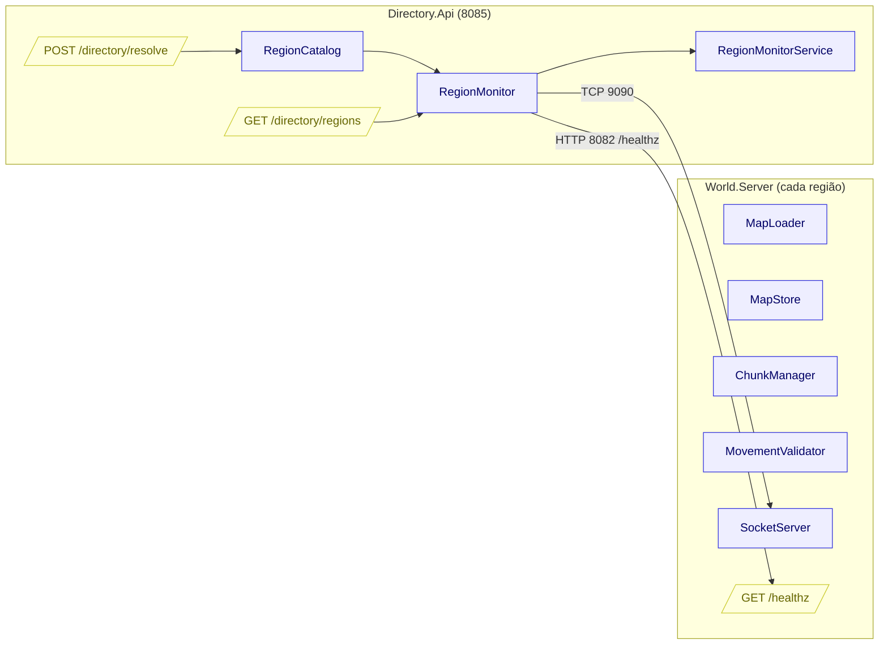

# Arquitetura C4 — Creature Realms

## Nível 1 — Contexto

## Nível 2 — Containers

- `Gateway` (NGINX):
  - Rotas para `Auth`, `IDP` e `Directory`.
  - Não acoplado aos mundos dinâmicos.
- `Auth` (`8080`): autenticação, JWT, Postgres.
- `IDP` (`8081`): perfis e personagens (Internalization Data of Player), Postgres/Redis.
- `Directory` (`8085`): descoberta e health dos mundos.
  - `GET /directory/regions`
  - `POST /directory/resolve`
- `World` (N instâncias): cada `Service` expõe `8082` (HTTP) e `9090` (TCP).
- Observabilidade: Elasticsearch, Kibana, Elastic Agent.
- Bancos: Postgres, Redis.

## Nível 3 — Componentes (Directory e World)

## Nível 4 — Código (visão de alto nível)

- `Directory.Api`:
  - `RegionCatalog`: lê `world.regions.json` e mantém metadados de regiões.
  - `RegionMonitor`: verifica `healthz` HTTP e tenta TCP `9090` como fallback.
  - `RegionMonitorService`: job a cada 30s atualizando estados.
  - Endpoints:
    - `GET /directory/regions` retorna `{name, online, clusterTcp, localTcp, lastChecked}`.
    - `POST /directory/resolve` retorna `{currentRegion, nextRegion, online, clusterTcp, localTcp}`.
- `World.Server`:
  - `SocketServer`: servidor TCP `9090` para gameplay.
  - `MapLoader/MapStore`: carregamento e armazenamento de mapas.
  - `ChunkManager`: gerenciamento de chunks.
  - `MovementValidator`: validação de movimentos e transições.

## Operação e Infra

- `infra.cmd up`:
  - Build/push: `Auth`, `IDP`, `Directory`.
  - `kubectl apply -k k8s` sem `World`.
  - `rollout restart`: `auth`, `IDP`, `gateway`, `directory`, `postgres`, `redis`.
- `world.cmd`:
  - `up` via `world.regions.json`: cria `Deployment/Service` por região.
  - `forward`: port-forward automatico com fallback para `pod`.
  - `forward stop`: encerra todos os port-forwards iniciados.

## Logs e Observabilidade

- Centralização de logs:
  - `Elastic Agent` como DaemonSet coleta logs de contêineres de todos os pods (`/var/log/pods/*/*/*.log`) e envia para `Elasticsearch`.
  - Parser `container` aplicado e campos adicionados com `kubernetes.cluster=local` conforme `k8s/elastic-agent/configmap.yaml` (filestream).
  - Fluxo: Serviços (`Auth`, `IDP`, `Gateway`, `Directory`, `World`) → `Elastic Agent` → `Elasticsearch` → visualização no `Kibana`.
- Kibana:
  - `Kibana` acessa `Elasticsearch` via `ELASTICSEARCH_HOSTS=http://elasticsearch:9200`.
  - Dashboards e busca centralizada por `namespace`, `pod`, `container`, e etiquetas de `kubernetes`.
- Extras de observabilidade:
  - `Prometheus` coleta métricas do `otel-collector` (`:9464`); `Tempo` recebe traces via OTLP; `Loki` pode receber logs via OTLP, com mapeamento opcional no `otel-collector`.

### Integração nos serviços (atualizada)
- `Directory.Api`:
  - Inclui `Observability.Extensions` com `AddObservability(builder.Configuration, "directory")`.
  - Aplica `UseRequestResponseLogging()` para logar request/response HTTP incluindo corpo e status.
  - Dockerfile atualizado para copiar `Observability/src` durante o build.
- `World.Server`:
  - Inclui `Observability.Extensions` com `AddObservability(builder.Configuration, "world")`.
  - Aplica `UseRequestResponseLogging()` para endpoints HTTP (ex.: `/healthz`, `/world/*`).
  - `SocketServer` loga eventos de fronteira:
    - `ghost_enter` com `host`, `port`, `x`, `y`
    - `ghost_leave` com `host`, `port`, `x`, `y`
    - `handoff` com `host`, `port`, `x`, `y`
  - Dockerfile atualizado para copiar `Observability/src` durante o build.
- OpenTelemetry:
  - Services enviam traces e métricas via OTLP para `otel-collector` (`http://tempo:4318` conforme `k8s/otel-collector/configmap.yaml`).
  - Logs estruturados em JSON e enviados ao `Elastic Agent` (integração nativa de container).
- Unity Client (diagnóstico):
  - `WorldConnector` emite `Debug.Log` para etapas críticas:
    - `Directory:GetSpawn` e resolução de endpoints (`localTcp/clusterTcp`)
    - `World:Connect/Reconnect` primário e secundário
    - `Socket:GhostEnter/GhostLeave` e pré-conexão de região vizinha
    - `Socket:Handoff` e promoção da conexão secundária
