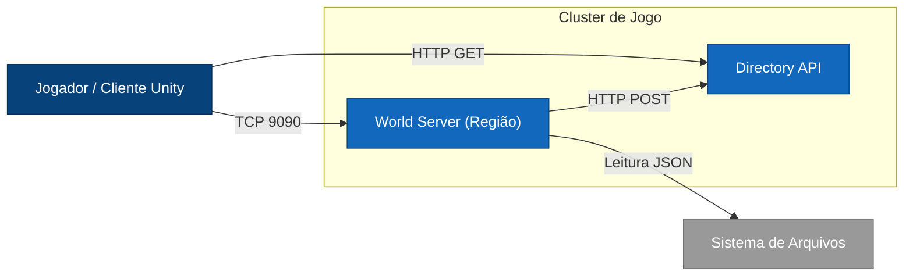
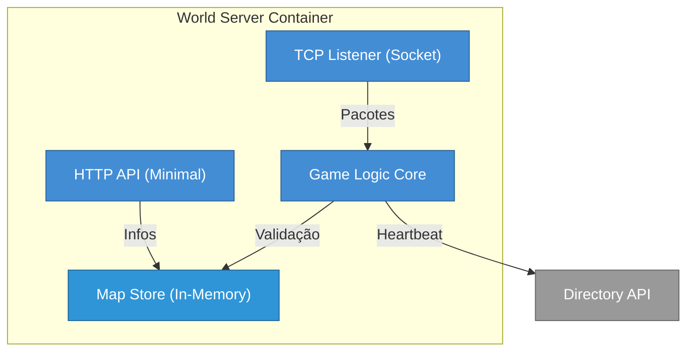
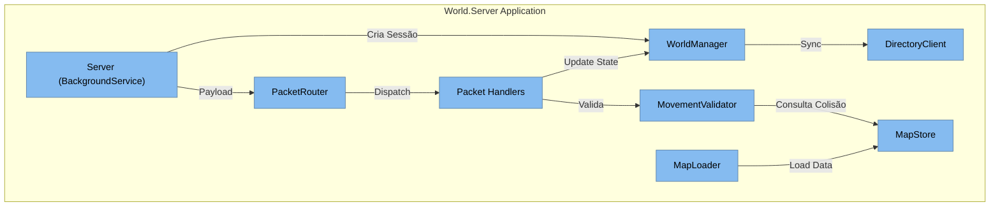

# Arquitetura C4 — World Server (Região)

Este documento detalha a arquitetura do componente `World Server`, responsável por gerenciar a lógica de jogo, sincronização de jogadores e persistência de estado em memória para uma região específica do mundo.

## Visão Geral

O **World Server** é uma aplicação .NET 8 (Console/BackgroundService) que opera como um servidor autoritativo para uma "região" do jogo (um mapa). Ele aceita conexões TCP de clientes (Unity), valida movimentos, gerencia "Ghost Zones" (áreas de fronteira) e se comunica com o `Directory API` para descoberta de serviços.

---

## Nível 1 — Contexto do Sistema

Diagrama de contexto mostrando como o World Server se encaixa no ecossistema.

---

## Nível 2 — Containers

O World Server é composto por camadas lógicas internas, mas opera como um único container implantável. Ele interage fortemente com o disco (para carregar mapas) e com a rede.

---

## Nível 3 — Componentes

Detalhe interno da aplicação `World.Server`. Aqui vemos como o código está estruturado.

### Principais Componentes

1.  **Server (Core)**: O loop principal. Aceita clientes TCP e despacha o stream de dados para o `PacketRouter`.
2.  **PacketRouter**: Analisa o cabeçalho do pacote (`PacketType`) e invoca o `Handler` correspondente.
3.  **Handlers**: Implementam `IPacketHandler`. Cada um trata um tipo de mensagem (ex: `MoveRequest`, `ClientConfig`).
4.  **WorldManager**: O "cérebro". Gerencia a lista de sessões (`ClientSession`), atribui IDs, e executa o broadcast de estado (`PlayersSnapshot`).
5.  **MapStore & MapLoader**: Responsáveis por ler os arquivos JSON (`map.json`, `tile_definitions.json`) e fornecer dados de colisão para o validador.
6.  **MovementValidator**: Garante que os jogadores não atravessem paredes ou saiam dos limites sem autorização.

## Fluxos Principais

### 1. Conexão de Jogador e Handshake
1.  **TCP Connect**: O cliente conecta na porta 9090.
2.  **Session Created**: `Server` chama `WorldManager.CreateSession`.
3.  **Client Config**: Cliente envia pacote `ClientConfig` (com Username e GhostZoneWidth).
4.  **Response**: Servidor responde com `GhostZoneInfo` (limites do mapa) e `PlayerInfo` (atribui ID ao jogador).
5.  **DeadZones**: Servidor envia lista de obstáculos estáticos para o cliente.

### 2. Movimentação e Sincronização
1.  **MoveRequest**: Cliente envia intenção de movimento (X, Y).
2.  **Validation**: `MoveRequestHandler` usa `MovementValidator` para checar se o destino é válido (não é parede, dentro dos limites).
3.  **Update**: Se válido, `ClientSession` é atualizada com nova posição.
4.  **Broadcast**: Periodicamente (ou por evento), `WorldManager.BroadcastPlayersSnapshot` envia a lista de todos os jogadores visíveis para todos os clientes conectados.

### 3. Ghost Zones (Fronteiras)
- Quando um jogador se aproxima da borda do mapa (definida em `GhostZoneWidth`), o cliente inicia conexão com o servidor da região vizinha.
- O servidor atual continua autoritativo até que o jogador cruze efetivamente a linha de fronteira (Handoff).

## Estrutura de Dados (Mapas)
O servidor carrega mapas de uma pasta configurada (`MAP_DATA_DIR`).
- **map.json**: Matriz de tiles e objetos.
- **tile_definitions.json**: Propriedades dos tiles (walkable, etc).
- **object_definitions.json**: Propriedades dos objetos (blocksMovement, etc).
