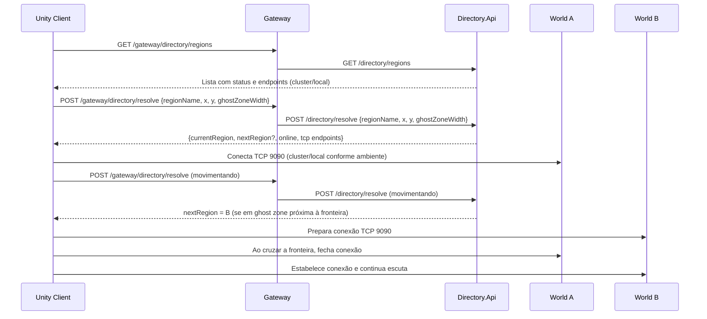

# Fluxos e Funcionamento

## Fluxo — infra up

```mermaid
flowchart TB
  A[Start infra.cmd up] --> B[Build/push Auth, Users, Directory]
  B --> C[kubectl apply -k k8s]
  C --> D[rollout restart: auth, users, gateway, directory, postgres, redis]
  D --> E[Infra OK (sem World)]
```

## Fluxo — world up e port-forward

```mermaid
flowchart TB
  A[Start world.cmd] --> B[Aplicar regiões via world_json.ps1]
  B --> C[Verificar Services (curta espera)]
  C --> D{Service existe?}
  D -- Sim --> E[Port-forward para service/world-<regiao>:9090]
  D -- Não --> F[Aplicar recursos da região (se necessário)]
  F --> G[Tentar novamente service]
  G -- Sim --> E
  G -- Não --> H[Buscar pod por label app.kubernetes.io/name]
  H -- Encontrado --> I[Port-forward para pod/<name>:9090]
  H -- Não --> J[Pular região (log warning)]
```

## Fluxo — Descoberta contínua (Directory)

```mermaid
flowchart LR
  A[RegionMonitorService (loop 30s)] --> B[Para cada região]
  B --> C[HTTP GET world-<regiao>:8082/healthz]
  C -- 200 --> D[Online=true]
  C -- falha --> E[Tentar TCP world-<regiao>:9090]
  E -- conectado --> D
  E -- falha --> F[Online=false]
  D --> G[Atualiza status {online, clusterTcp, localTcp, lastChecked}]
  F --> G
```

## Sequência — Handoff do Cliente Unity



## Considerações de Resiliência

- Directory desacoplado do Gateway e dos mundos, permitindo N regiões dinâmicas.
- Port-forward local tolera ausência temporária de Services/Pods (execução rápida com fallback).
- `infra.cmd` não inclui World; mundos sobem pelo `world.cmd` via JSON.
- Unity consome Directory via Gateway: `/gateway/directory/*`.
