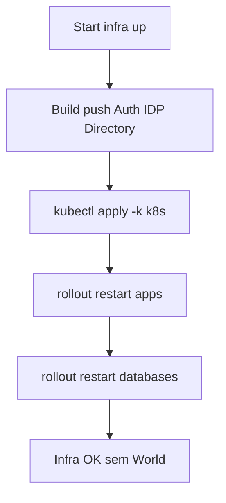
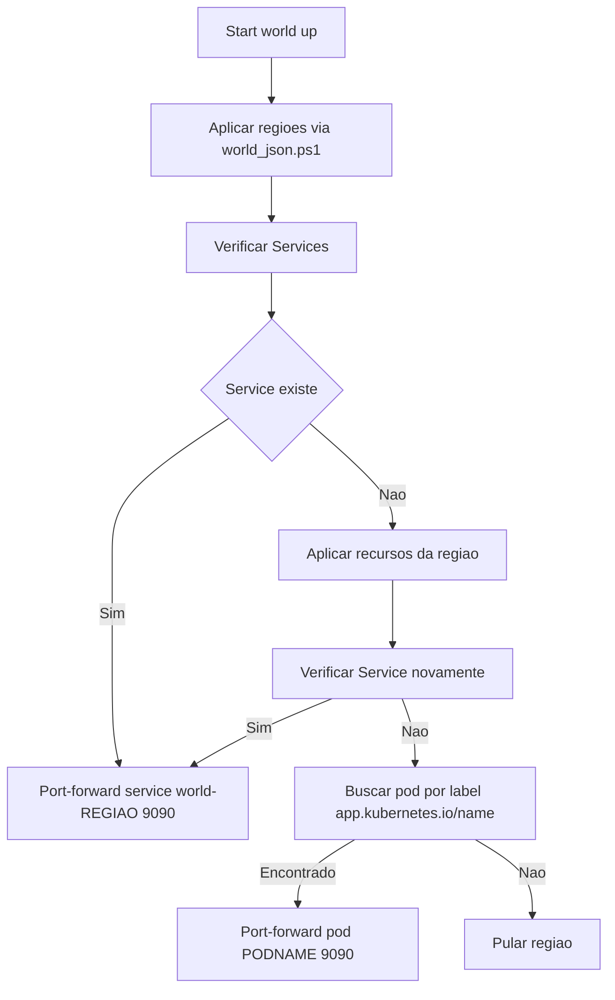
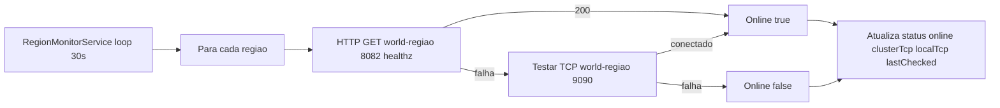
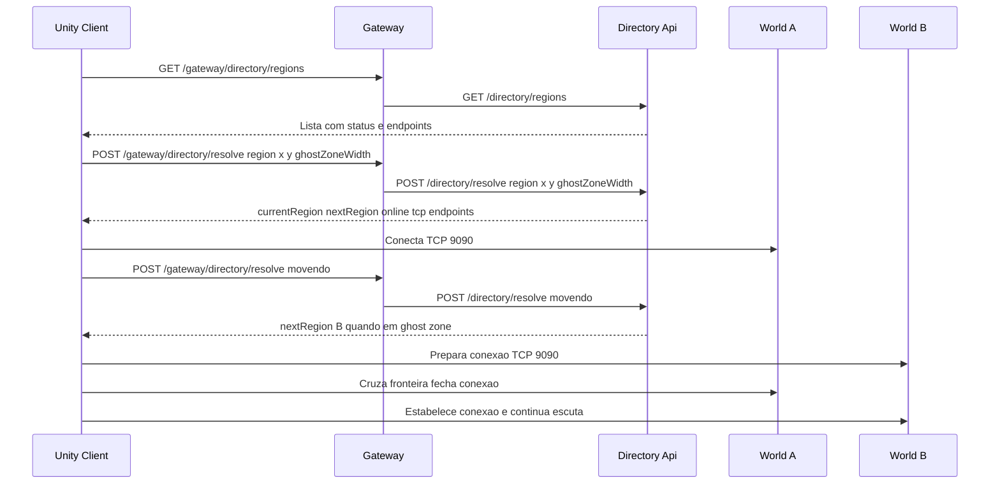

# Fluxos e Funcionamento

## Fluxo — infra up

## Fluxo — world up e port-forward

## Fluxo — Descoberta contínua (Directory)

## Sequência — Handoff do Cliente Unity

## Considerações de Resiliência

- Directory desacoplado do Gateway e dos mundos, permitindo N regiões dinâmicas.
- Port-forward local tolera ausência temporária de Services/Pods (execução rápida com fallback).
- `infra.cmd` não inclui World; mundos sobem pelo `world.cmd` via JSON.
- Unity consome Directory via Gateway: `/gateway/directory/*`.
